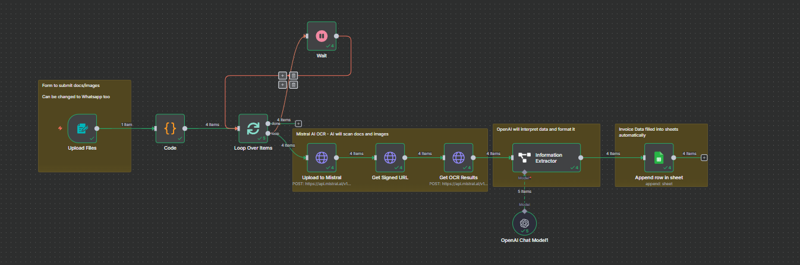

# Auto‑Invoice Processor (n8n)

A n8n workflow that turns raw invoice uploads into structured data and logs them to Google Sheets. It uploads each file to Mistral OCR, parses fields with an LLM, and appends a clean row to a spreadsheet—hands‑off invoice intake from upload to analytics. This is an adapted and modified version of Nate Herk's flow, this one just allows for multiple files to be uploaded instead of one file per run!

## What’s inside
- **Workflow JSON:** `workflows/Auto-Invoice Processor (1WF).json`
- **Docs:** Architecture & setup notes in `docs/`

## How it works (flow)
1. **Form Trigger – “Upload Files”**: end‑users upload one or more invoices (PDF/images) via a form with field **“File invoice”**.
2. **Code (one item per file)**: explodes multi‑file uploads so each run item contains **exactly one** binary under a stable key—prevents multi‑upload key mismatches.
3. **Loop over items** (Split‑in‑Batches pattern with a Wait back‑edge) to process files safely.
4. **HTTP – Upload to Mistral**: multipart upload with `purpose=ocr`.
5. **HTTP – Get Signed URL** for the uploaded file (short‑lived link).
6. **HTTP – Run OCR** with `model: mistral-ocr-latest` to extract text/vision features.
7. **Information Extractor** (LLM) pulls structured fields (invoice_id, company, dates, totals, tax, product lines).
8. **Google Sheets – Append** writes a tidy row for each invoice.


```

```

## Quick start (local n8n)
1. **Import** `workflows/Auto-Invoice Processor (1WF).json` into n8n.
2. **Set credentials**:
   - Mistral API key (HTTP nodes use header auth).
   - Google Sheets OAuth for the target spreadsheet.
3. **Update the Sheets node** to your spreadsheet (or use the provided one if it’s yours).
4. **Enable the Form Trigger** (Webhook) and test with one or more invoices.

